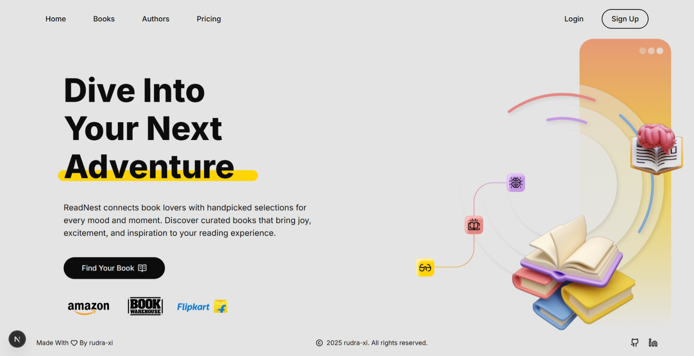

# ReadNest

A simple, elegant Next.js single-page landing experience.

Welcome to **ReadNest**! This is my first project built with [Next.js](https://nextjs.org). The goal of this project is to learn how Next.js works by creating a simple, elegant, and clean single landing page experience.

## Features

-    **Single Page:** This project features just one page containing some text and SVG graphics. Still exploring and figuring out Next.js.
-    **Minimal Components:** Designed with simplicity and ease of use in mind.
-    **Modern Styling:** Built with [Tailwind CSS](https://tailwindcss.com/) for fast, responsive, and flexible styling.
-    **UI Libraries:** Utilizes [shadcn/ui](https://ui.shadcn.com/) for UI components and [lucide-react](https://lucide.dev/) for crisp, customizable icons.
-    **After Work:** Not planning to make the site responsive — currently focused on desktop and larger screen experiences.

## Project Structure

Here is an overview of the key folders and files in this project:

```
📁 public/
│  └── 📁 assets/
│       ├── assets.ts
│       ├── book-amazon.svg
│       ├── book-warehouse.svg
│       ├── flipkart.svg
│       └── heroImage.svg
📁 src/
│  ├── 📁 app/
│  │   ├── 📁 components/
│  │   │   ├── 📁 ui/
│  │   │   │   ├── github.tsx
│  │   │   │   └── linkedin.tsx
│  │   │   ├── Footer.tsx
│  │   │   └── Navbar.tsx
│  │   ├── favicon.ico
│  │   ├── globals.css
│  │   ├── layout.tsx
│  │   └── page.tsx
│  └── 📁 lib/
│       └── utils.ts
package.json
next.config.ts
README.md
```

## Getting Started

Follow these steps to get the project up and running locally:

1. **Clone the repository:**

     ```
     git clone https://github.com/rudra-xi/read-nest.git
     ```

2. **Install dependencies:**

     ```
     npm install
     ```

3. **Start the development server:**

     ```
     npm run dev
     ```

4. Open your browser and navigate to `http://localhost:3000` to see the app in action.

## Screenshots



## Author

[](https://github.com/rudra-xi)

## Contact

[](https://www.instagram.com/rudra.xii/)
[](https://www.linkedin.com/in/goutam-rudraxi)

## License

This project is licensed under the MIT License. See the [](/LICENSE) file for more information.
